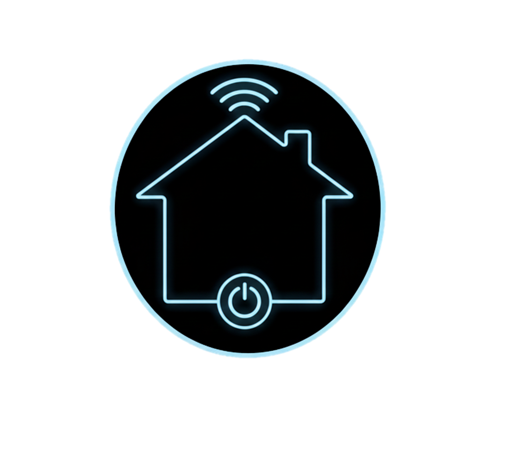

# Smart Environment App

<p align="center">
  
</p>

<p align="center">
    <em>Un panel de control para un entorno inteligente, construido con Jetpack Compose y Firebase.</em>
</p>

---

## 📋 Descripción General

**Smart Environment** es una aplicación nativa de Android que funciona como un dashboard centralizado para la gestión de un hogar u oficina inteligente. Permite a los usuarios interactuar con dispositivos conectados, monitorear información ambiental en tiempo real y organizar sus tareas personales, todo sincronizado a través de Firebase Firestore.

## ✨ Funcionalidades Principales

- **Control de Dispositivos:** Gestión en tiempo real del estado (encendido/apagado) de luces, bocinas, cafeteras y otros dispositivos.
- **Monitor de Clima:** Muestra las condiciones meteorológicas actuales obtenidas de una API externa, permitiendo al usuario cambiar de ubicación.
- **Gestión de Recordatorios:** Un sistema de tareas pendientes (To-Do) donde los usuarios pueden añadir, completar y eliminar recordatorios.
- **Historial de Acciones:** Cada interacción importante (cambios de estado de dispositivos, creación de recordatorios, etc.) se registra automáticamente en una colección `actions_logs` en Firestore, proveyendo una bitácora para auditoría.
- **Interfaz Responsiva:** Construida con Jetpack Compose, la UI se adapta a diferentes tamaños de pantalla, incluyendo tabletas y dispositivos de formato grande como TVs.

## 🛠️ Arquitectura y Stack Tecnológico

La aplicación sigue una arquitectura moderna **MVVM (Model-View-ViewModel)** para asegurar una separación clara de responsabilidades y facilitar el mantenimiento.

- **View (UI Layer):** Construida 100% con **Jetpack Compose**. Los Composables son "tontos" y se limitan a mostrar el estado provisto por el ViewModel.
- **ViewModel (Logic Layer):** El `DashboardViewModel` centraliza toda la lógica de negocio, gestiona el estado de la UI y actúa como única fuente de verdad para la interfaz.
- **Model (Data Layer):** Compuesto por:
    - **Clases de Datos Kotlin:** (`Reminder`, `AlertData`, `WeatherData`) que modelan la información.
    - **Firebase Firestore:** Como base de datos NoSQL en tiempo real para sincronizar el estado entre la app y la nube.
    - **Retrofit:** Para gestionar las llamadas de red a la API del clima de forma eficiente.

### Tecnologías Clave:
- **Lenguaje:** Kotlin
- **UI Toolkit:** Jetpack Compose
- **Base de Datos:** Firebase Firestore
- **Llamadas de Red:** Retrofit & Gson
- **Asincronía:** Kotlin Coroutines
- **Gestión de Estado:** `StateFlow` y `mutableStateOf` con `ViewModel` de Jetpack.

## 🔧 Configuración e Instalación

1.  **Clonar el Repositorio:**
    ```bash
    git clone https://github.com/tu-usuario/smart-environment.git
    ```
2.  **Conexión con Firebase:**
    - Descarga tu propio archivo `google-services.json` desde la consola de Firebase.
    - Coloca el archivo en el directorio `app/`.

3.  **Compilar y Ejecutar:**
    - Abre el proyecto en Android Studio.
    - Sincroniza las dependencias de Gradle.
    - Ejecuta la aplicación en un emulador o dispositivo físico (API 33 recomendado).

## 📂 Estructura del Proyecto

- **`/app/src/main/java/com/example/smartenvironment/`**
    - `MainActivity.kt`: Punto de entrada de la app.
    - `DashboardViewModel.kt`: Cerebro de la aplicación, contiene toda la lógica.
    - **`data/`**: Contiene los modelos de datos (`Reminder`, `AlertData`) y el servicio de red (`WeatherApiService`).
    - **`ui/`**: Contiene los Composables que definen las pantallas (`DashboardScreen.kt`, `RemindersScreen.kt`, etc.) y el tema de la app.
- **`/app/build.gradle.kts`**: Define todas las dependencias del proyecto.
- **`/app/src/main/res/drawable/`**: Contiene los recursos gráficos, incluyendo el logo `logo_se.png`.